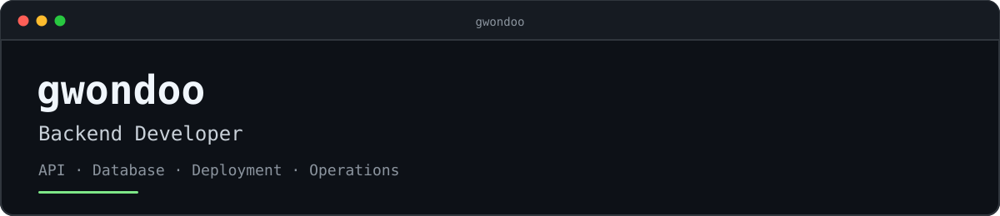

## Profile

```text
role      Backend Developer @ Lab4DX
work      API · Database · Deployment · Operations
current   B2B AI Platform
focus     Reliable backend systems and production problem solving
```

## Stack

**Backend**  
    

**Data**  
    

**Infrastructure**  
   

## Projects

[](https://github.com/kookmin-sw/capstone-2025-03) [](https://github.com/Peeliee/peelie-server)

<details>
<summary><strong>More projects</strong></summary>

<br>

[](https://github.com/coolnyangi/haruharu-server) [](https://github.com/gwondoo/cupitalk-server) [](https://github.com/gwondoo/klav-server) [](https://github.com/gwondoo/jeommechu)

</details>

<br>

<picture>
  <source media="(prefers-color-scheme: dark)" srcset="https://raw.githubusercontent.com/gwondoo/gwondoo/output/github-snake-dark.svg" />
  <source media="(prefers-color-scheme: light)" srcset="https://raw.githubusercontent.com/gwondoo/gwondoo/output/github-snake.svg" />
  
</picture>

## Contact

[](mailto:6568kdh@naver.com) [](https://www.linkedin.com/in/gwondawn/)
